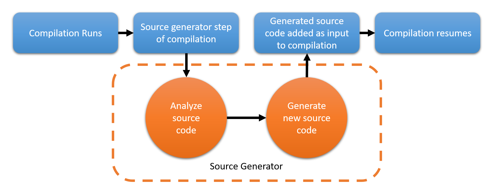

# Unlocking Efficiency with Source Code Generators in C#

**Introduction**:

As software developers, we often find ourselves facing a mundane and repetitive task - writing boilerplate code. It's not only uninteresting but also adds little value to our skillset. Consider the ubiquitous **`Equals()`** method – a prime example of such repetitive code. What if I told you that your computer could generate this code for you during compilation, saving you precious time and effort? It may sound like a "wow" moment, but it's entirely achievable through a technique known as Source Code Generation in the .NET world.

**What Are Source Code Generators?**

According to Microsoft:

> A Source Generator is a powerful tool for C# developers, allowing them to perform two critical functions:
> 
> 1. Generate C# source files that can be added to a Compilation object during compilation, effectively instructing your machine to generate new code.
> 2. Access a Compilation object that represents all user code being compiled. This object can be examined to work with the syntax and semantic models of the code, similar to analyzers.

In simpler terms, as a developer, you gain access to the *Compilation* object, granting you insights into the compiler's output and empowering you to instruct your machine to generate code. Source Generation is essentially an extension of code analyzers that we use daily without even realizing it. For example, think of your IDE suggesting improvements to your code, such as switching from a conventional switch-case statement to a switch expression pattern – this suggestion and code replacement are powered by your IDE's code analyzer.

Source Generators were introduced by Microsoft in .NET 5.0, initially called Source Generators and later enhanced and rebranded as Incremental Source Generators in .NET 6. These generators operate during the compilation phase, as depicted below:


Image src: https://devblogs.microsoft.com/dotnet/introducing-c-source-generators/

**Key Points to Note**:

1. Source Generators do not replace other methods of code generation or injection.
2. Source Generators do not modify or delete existing code. They can only generate new code.

**Prerequisites**:

To dive into the world of source generation, you need the following:

1. dotnet SDK ≥ 6.0.0
2. An IDE of your choice - Visual Studio, VS Code, Jetbrains Rider

**A Practical Example: Generating the Equals Method**

Let's take a simple example to demonstrate source generation – generating the **`Equals`** method for a model class. We'll create a model class called **`Employee`** with three properties, and we'll also annotate properties with a marker attribute to denote their participation in the **`Equals`** comparison.

Before we delve into source generation, there are a few prerequisites for code analyzers (source generators):

1. The code analyzer project should be independent and target ≥ .NET Standard 2.0.
2. It should have the following NuGet dependencies:
    - Microsoft.CodeAnalysis.Analyzers
    - Microsoft.CodeAnalysis.CSharp
3. Since we are generating new code for an existing class (to override the **`Equals`** method), we need to declare the class as `partial`. Remember, we are generating code for an already existing class.

Initially, your **`Employee`** class in the client project looks like this:

```csharp
public partial class Employee
{
    public Guid Id { get; set; }
    public string Name { get; set; }
    public string SocialSecurityNumber { get; set; }
}
```

**Introduction to `Generator` and `IIncrementalGenerator`:**

In the world of C# Source Code Generators, the **`Generator`** attribute and the **`IIncrementalGenerator`** interface play pivotal roles. These components are the heart and soul of source code generation in C#.

- **`Generator` Attribute**:
    
    The **`Generator`** attribute is a crucial marker that identifies a class as a source code generator. When you apply this attribute to a class, you're essentially telling the C# compiler that this class holds the logic for generating source code during compilation. This attribute is the key to integrating your source code generation logic into the build process.
    
    ```csharp
    [Generator]
    public sealed class CodeEmitter : IIncrementalGenerator
    {
        // Generator logic goes here
    }
    ```
    
    In the example above, **`CodeEmitter`** is marked with the **`Generator`** attribute, signifying that it's responsible for generating source code.
    
- **`IIncrementalGenerator` Interface**:
    
    The **`IIncrementalGenerator`** interface is the contract that your source code generator class must adhere to. It defines a set of methods and properties that your class needs to implement in order to participate in source code generation.
    
    ```csharp
    [Generator]
    public sealed class CodeEmitter : IIncrementalGenerator
    {
        public void Initialize(IncrementalGeneratorInitializationContext context)
        {
            // Initialization logic here
        }
    
        // Other required methods and properties
    }
    ```
    

In the **`CodeEmitter`** class, we implement the **`Initialize`** method from the **`IIncrementalGenerator`** interface. This method is invoked during the initialization phase of source code generation and allows you to register code to be generated.

The combination of the **`Generator`** attribute and the **`IIncrementalGenerator`** interface empowers you to take control of source code generation during compilation, opening up a world of possibilities for automating repetitive tasks, enhancing code quality, and improving development efficiency.

**Generating the `Equals` Method: A Step-by-Step Guide**

1. **Generate Marker Attribute and Annotate Properties**:
    - Begin by creating a marker attribute, such as the **`IncludeInEqualsAttribute`**. This attribute serves as a flag to denote which properties are meant to participate in the **`Equals`** method.
    - Annotate the properties within your model classes that you wish to include in the **`Equals`** method with this marker attribute. This step is crucial as it identifies the properties that should be part of the equality comparison.
2. **Create a Template for the `Equals` Method**:
    - Develop a template for the **`Equals`** method. This template defines the structure of the method, including the method signature, the logic for comparing properties, and any additional code required. The source generator will use this template to generate the **`Equals`** method for each model class.
3. **Identify Model Classes for `Equals` Method Generation**:
    - Determine the model classes for which you intend to generate the **`Equals`** method. These are the classes that will benefit from an automatically generated **`Equals`** method. The source generator should target these specific classes during the code generation process.
4. **Identify Properties and Generate Code**:
    - Within each model class, identify the properties that should be included in the **`Equals`** method. This selection is based on the presence of the marker attribute (**`IncludeInEqualsAttribute`**).
    - Generate the actual code that constitutes the **`Equals`** method based on the selected properties and the template developed in Step 2.
5. **Inject Generated Code into the Compilation Pipeline**:
    - To ensure that the generated **`Equals`** method becomes part of the compiled code, reintroduce the generated code into the compilation pipeline.
    - This may involve actions like writing the generated code to a file, embedding it within the source code, or integrating it into the compilation process.

1. **Generate Marker Attribute and Annotate Properties**:

Before we proceed with generating the **`Equals`** method, we need to create the marker attribute **`IncludeInEqualsAttribute`** and ensure that it is applied to the properties that should be considered in the **`Equals`** comparison.

One of the powerful features of source generators is the ability to generate code immediately after initialization using the **`RegisterPostInitializationOutput`** method. This functionality is particularly useful for scenarios where you need to make generated code immediately visible to subsequent steps within the source generation process.

Suppose you want to create a marker attribute called **`IncludeInEqualsAttribute`** to denote properties that should participate in the **`Equals`** method generation. Instead of declaring this attribute manually, you can generate it dynamically using the source generator.

First, within your source generator class marked with the **`Generator`** attribute, in the **`Initialize`** method, you can use **`RegisterPostInitializationOutput`** to create and register the **`IncludeInEqualsAttribute`**:

```csharp
context.RegisterPostInitializationOutput(ctx =>
    ctx.AddSource("IncludeInEqualsAttribute.g.cs", 
        @"
        namespace YourNamespace
        {
            [System.AttributeUsage(System.AttributeTargets.Property)]
            public sealed class IncludeInEqualsAttribute : System.Attribute
            {
            }
        }
        ")
);
```

In the code above, you're creating a source file for the **`IncludeInEqualsAttribute`** and registering it during the initialization process. This makes the attribute immediately available for subsequent source generation steps.

By generating the **`IncludeInEqualsAttribute`** in this way, you ensure that it is available for applying to properties right after the source generator's initialization phase. Developers can readily annotate their properties with this attribute, simplifying the process of marking properties for inclusion in the **`Equals`** method generation.

This approach not only automates the creation of the marker attribute but also showcases the practical usage of **`RegisterPostInitializationOutput`** to make generated code immediately visible and actionable within the source generation process.

Full snippet looks like this:

```csharp
using Microsoft.CodeAnalysis;

namespace SourceGen
{
    [Generator]
    public sealed class CodeEmitter : IIncrementalGenerator
    {
        public void Initialize(IncrementalGeneratorInitializationContext context)
        {
            context.RegisterPostInitializationOutput(ctx =>
                ctx.AddSource("IncludeInEqualsAttribute.g.cs", 
                    @"
namespace ConsoleClient;
[System.AttributeUsage(AttributeTargets.Property)]
public sealed class IncludeInEqualsAttribute : System.Attribute
{
}
                "
                )
            );
        }
    }
}
```

Once you compile the above, you will be able to use the *generated* attribute like any other attribute. 

```csharp
public partial class Employee
{
    [IncludeInEquals]
    public Guid Id { get; set; }
    public string Name { get; set; }
    [IncludeInEquals]
    public string SocialSecurityNumber { get; set; }
}
```

1. **Create a Template for the `Equals` Method**:

We'll also need to define the template for the **`Equals`** method, including the **`GetHashCode`** method, to avoid compiler warnings:

```csharp
public const string EqualsMethod = @"
namespace ConsoleClient;
public partial class {0} 
{{
    public override bool Equals(object? obj)
    {{
        if(obj == null) return false;
        if(obj is not {0} input) return false;

        return {1};
    }}

    public override int GetHashCode()
    {{
        return HashCode.Combine({2});
    }}
}}
```

1. **Identify Model Classes for `Equals` Method Generation**:

To generate code, we must first determine which classes require code generation. This can be accomplished in two key steps:

1. **Identify Classes with Attributed Properties**: The initial step involves identifying classes whose properties have associated attributes. This step relies on the **`IsClassTargetedForGeneration`** method.
    
    ```csharp
    private bool IsClassTargetedForGeneration(SyntaxNode syntaxNode)
    {
        if (syntaxNode is not ClassDeclarationSyntax classDeclarationSyntax) return false;
        return classDeclarationSyntax.Members.SelectMany(m => m.AttributeLists).Any();
    }
    ```
    
2. **Filter Classes Based on `IncludeInEqualsAttribute`**: 1. n the subsequent step, we further refine our selection. Specifically, we filter out classes from the previous step whose properties are annotated with the **`IncludeInEqualsAttribute`**. This filtering operation is accomplished using the **`GetTargetClassForGeneration`** method.

```csharp
private ClassDeclarationSyntax? GetTargetClassForGeneration(GeneratorSyntaxContext context)
{
    if (context.Node is not ClassDeclarationSyntax declarationSyntax)
    {
        return null;
    }

    // Read properties of the class
    var propertyMembers = declarationSyntax
        .Members
        .Where(m => m.IsKind(SyntaxKind.PropertyDeclaration));
    
    // Read all the attributes of the properties
    var attributes = propertyMembers.SelectMany(p => p.AttributeLists)
        .SelectMany(al => al.Attributes)
        .ToList();
    
    // Use Semantic model of each attribute to know if it matches with our marker attribute or not
    foreach (var attribute in attributes)
    {
        if (ModelExtensions.GetSymbolInfo(context.SemanticModel, attribute).Symbol is not IMethodSymbol attributeSymbol)
        {
            // return null;
            continue;
        }

        var fullName = attributeSymbol.ContainingSymbol.ToDisplayString();
        // Check if the attribute name matches our marker attribute
        if (fullName == "ConsoleClient.IncludeInEqualsAttribute")
        {
            return declarationSyntax;
        }
    }

    // No attributes, return null
    return null;
}
```

This structured approach helps us pinpoint the classes that necessitate code generation, ensuring that we apply code generation only where it's required.

By applying the aforementioned methods as shown below, we ultimately obtain the list of classes that meet our specific criteria.

```csharp
var classDeclarations = context
    .SyntaxProvider
    .CreateSyntaxProvider(
        predicate: (s, _) => IsClassTargetedForGeneration(s), 
        transform: (ctx, _) => GetTargetClassForGeneration(ctx))
    .Where(m => m is not null); // filter out null values
```

1. **Identify Properties and Generate Code**:

Now, we are ready to generate the **`Equals`** method for each of the selected classes. We use the template we defined earlier to fill in the placeholders and emit the code into the compiler.

```csharp
private void Generate(Compilation compilation, ImmutableArray<ClassDeclarationSyntax> classDeclarationSyntaxes,
            SourceProductionContext sourceProductionContext)
{
    var codeBuilder = new StringBuilder();
    var hashBuilder = new StringBuilder();
    var includeInEqualsAttributeTypeSymbol =
        compilation.GetTypeByMetadataName($"ConsoleClient.IncludeInEqualsAttribute")!;

    foreach (var classDeclarationSyntax in classDeclarationSyntaxes)
    {
        var semanticModel = compilation.GetSemanticModel(classDeclarationSyntax.SyntaxTree);
        var namedTypeSymbol = semanticModel.GetDeclaredSymbol(classDeclarationSyntax);
        if (namedTypeSymbol is null) continue;

        var properties = namedTypeSymbol.GetMembers();
        foreach (var property in properties)
        {
            if (property is not IPropertySymbol) continue;

            var propertyAttributes = property.GetAttributes();
            if (CanIncludeInEquals(propertyAttributes, includeInEqualsAttributeTypeSymbol))
            {
                codeBuilder.Append($"this.{property.Name} == input.{property.Name} && ");
                hashBuilder.Append($"{property.Name},");
            }
        }

        var generated = codeBuilder.ToString();
        generated = generated.Trim(' ').Trim('&').Trim('&').TrimEnd();
        var hashingProps = hashBuilder.ToString().TrimEnd(',')!;
        var generatedPartial = string.Format(EqualsMethod, namedTypeSymbol.Name, generated, hashingProps);
        sourceProductionContext.AddSource($"{namedTypeSymbol.Name}.g.cs", SourceText.From(generatedPartial, Encoding.UTF8));

        codeBuilder.Clear();
        hashBuilder.Clear();
    }
}
```

1. **Inject Generated Code into the Compilation Pipeline**:

We need to call the **`Generate`** method from the **`Initialize`** method by passing in the compilation, array of **`ClassDeclarationSyntax`** instances, and the **`SourceProductionContext`**.

```csharp
context.RegisterSourceOutput(compilationAndClasses, 
                (spc, cnc) => Generate(cnc.compilation, cnc.ClassDeclarationSyntaxes, spc));
```

**Testing the Code Generation**:

To verify that the code generation is functioning as expected, we can create a simple test in the **`Program.cs`** of our console application. The output should match our expectations.

Here's a sample code for **`Program.cs`**:

```csharp
using System;

namespace ConsoleClient
{
    class Program
    {
        static void Main(string[] args)
        {
            Employee employee1 = new Employee
            {
                Id = Guid.NewGuid(),
                Name = "John Doe",
                SocialSecurityNumber = "123-45-6789"
            };

            Employee employee2 = new Employee
            {
                Id = Guid.NewGuid(),
                Name = "Jane Smith",
                SocialSecurityNumber = "987-65-4321"
            };

            bool areEqual = employee1.Equals(employee2);

            Console.WriteLine("Are the employees equal? " + areEqual);
        }
    }
}
```

In this code, we create two instances of the **`Employee`** class and compare them using the generated **`Equals`** method. The **`areEqual`** variable should reflect whether the employees are considered equal based on our code generation logic.

This test code will help confirm that the code generation is working as expected and that the **`Equals`** method correctly considers the properties marked with the **`IncludeInEqualsAttribute`** in the comparison.

Testing your code generation is crucial to ensure that the generated code functions correctly and meets your requirements. The provided test in **`Program.cs`** validates the **`Equals`** method's behavior for the **`Employee`** class.

Feel free to adapt this test to your specific use case and add more tests as needed to validate the generated code's functionality.

**Conclusion**:

Source Code Generators in C# are a powerful tool for enhancing your development efficiency. By automating repetitive coding tasks and seamlessly integrating with your IDE, they can save you time and improve code quality. This post provides a basic introduction to Source Generators, but there's much more you can explore and achieve with this feature. To delve deeper, experiment with the code provided in the [GitHub repository](https://github.com/sampath13/dotnet-source-generator) associated with this post.

**References**:

- [Introducing C# Source Generators - .NET Blog](https://devblogs.microsoft.com/dotnet/introducing-c-source-generators/)
